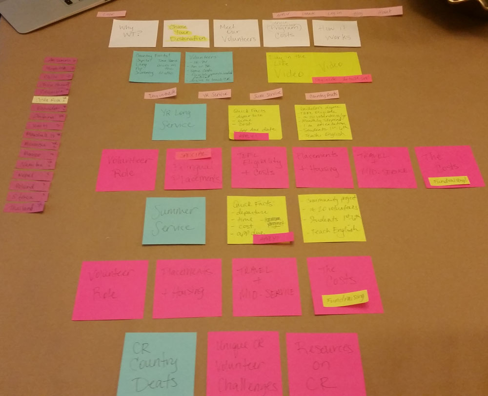

# Content Process

## Content Cataloging

Once I narrowed down my 4 pages for the project, I started cataloging all of the content that is currently on the website for the main pages. Below are links to each markdown file with that content.

* [Home](https://github.com/cczapski/tiy_assignments/blob/master/final_project/content/content_home.md)
* [For Future + Current Volunteers](https://github.com/cczapski/tiy_assignments/blob/master/final_project/content/content_volunteers.md)
* [Choose Your Destination](https://github.com/cczapski/tiy_assignments/blob/master/final_project/content/content_destinations.md)
* [Country Page - Costa Rica](https://github.com/cczapski/tiy_assignments/blob/master/final_project/content/content_country_page.md)

## Paper Prototyping

From there, I started paper prototyping with the Country Page. I chose the Country Page because it has the most content (an overwhelmingly large amount) and I knew it would be the most difficult to create the most effective layout and structure. 

Here is a quick snapshot of the paper prototyping with all of the Country Page content on one page. 

