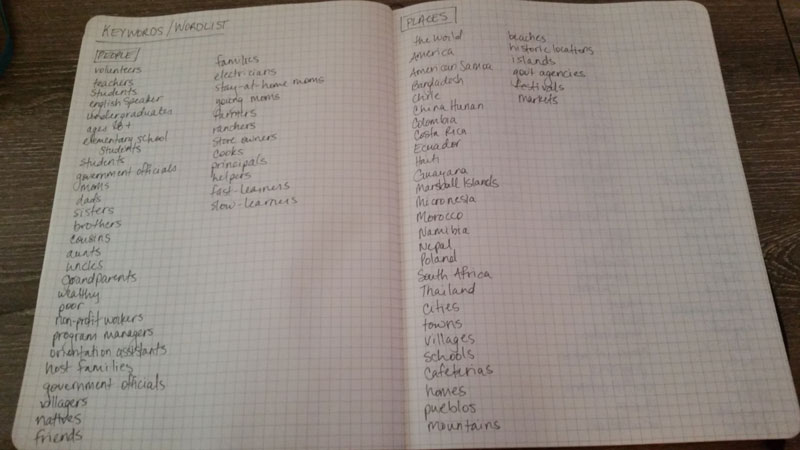
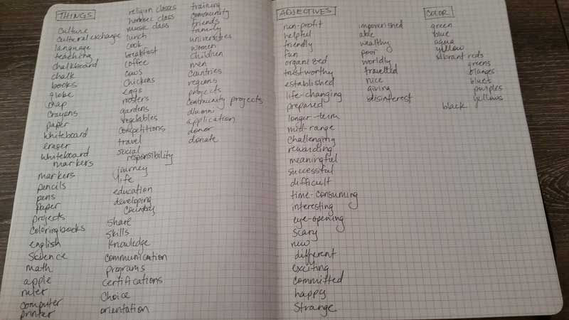

# WorldTeach Proposal

## Project Deliverables

* Final website that meets these technical capabilities:
    * 4+ HTML, 1+ compiled CSS file (with Bourbon & Sass)
    * Reset CSS coding
    * Responsive site capabilities with:
        * 3+ views
        * Percentage based-width on divs
        * Max-width in pixels
        * Em-based typography
        * Flexible images and alt tags
    * 1+ JS or jQuery dependent plug-in adding to the user experience
    * Modernizr.js for progressive enhancement and graceful fall-back
* Coded Style Guide (HTML and CSS) that includes the typography, colors, buttons, icons and other documentation for the design
* Icon set of 3 - 5 icons custom designed
* 10+ Responsive Sketches showing 3+ breakpoints
* 3+ Style Tiles and their written concepts
* 2+ Rapid Wireframes of 3 concepts in Illustrator
* All work, including sketches, wireframes, etc, uploaded to Github and GH-pages within its own repository that includes a readme file detailing the concept and process (up to 400 words)
* Final 5-minute presentation
* Time-sheet with all hours logged

## Game Plan

* Day 1: Initial Research (about, user interviews, competitive market analysis, SWOT), Proposal
* Day 2: Finalzing Research (keywords/wordlists, this not that), Evaluating Research, Content Analysis, Site Map, 4 Page Selection
* Day 3: Icons Workshop, Content Collection
* Day 4: Logo/Icon Start, Content Strategy, Paper Prototyping, Sketches
* Day 5: Wireframes, Exploring Color and Type, Starting Style Tiles
* Day 6: Finalize Style Tiles, Starting Mock Ups
* Day 7: Mock Ups, Exploring CMS Options
* Day 8: Style Guide, Learning CMS
* Day 9: Starting to Code (setting up basic HTML and layouts)
* Day 10: Coding
* Day 11: Coding
* Day 12: Coding
* Day 13: Coding
* Day 14: Presentation Prep

Presenation: Tuesday, August 11th @ 9 am

## History & Intro 
WorldTeach is a non-profit organization that pairs volunteers with partner countries throughout the world to teach for summer, semester, and year-long teaching sessions that cater towards the needs of the local community and promote responsible global citizenship.

WorldTeach's volunteer teach abroad programs are the only of their kind open to adults with no education background that offer the level of commitment and time towards promoting cross-cultural social responsibility in education.

For a more in-depth analysis of WorldTeach, check out [All About WorldTeach](https://github.com/cczapski/tiy_assignments/blob/master/final_project/research/all_about_worldteach.md)`.

[View the current WorldTeach website](http://www.worldteach.org/).

## WorldTeach Beliefs

We believe *all* people are equal.

We believe *all* people have a right to education.

We believe people of this world can make education accessible to *all*.

We believe *you* can help make the difference with us.

Where in the World do you want to Teach?

## Project Issues and Goals

### Main Goal

* Inspire people with the same beliefs as WorldTeach to take action towards expanding accessibility of global education with them

### Issues & Challenges

* Motivating the appropriate audience to participate through the website
* Effectively communicating the Why of WorldTeach
* Providing as much necessary information to users in the most concise and effective manner
* Telling WorldTeach's story and the story of their volunteers

## Audience

### Who are they?

* Native or native-level English speakers
* Age 18 to 75 (in most countries)
* Bachelor's degree holders by the date of the program's departure (for year-long and semester programs only)
* Volunteers interested in teaching as the main type of volunteer activity
* Current teachers or people interested in exploring teaching 
* Individuals looking for a break or new experience outside of their current job or career
* Recent college graduates wanting to live abroad
* Individuals who want to obtain a TEFL certification
* Volunteers who want to explore a new culture and language through volunteer activities
* Any person meeting the WorldTeach requirements that wants to volunteer abroad
* Individuals with no previous teaching experience or education in teaching

###What is most important to them in a volunteer program?

Personal preferences on country, language of country, price, etc. will all vary on the specific volunteer. Below are some of the most common questions that users exploring education-focused volunteer abroad programs will ask themselves when deciding on a program to choose from (in no particular order). 

* What is the length of the volunteer program?
* Does the organization align with my personal values, goals, and/or expectations for volunteering abroad?
* Is there any experience or qualification requirements for the program(s), and if so, do I meet those?
* What is the before, during and after program support from the organization like?
    * Who is my main point of contact for all preparation for the trip?
    * Who is my main point of contact during the trip, and for any emergencies while in country?
* How do you place volunteers in their locations?
* What happens if I want to leave my placement?
* Is the organization well-established?
* Can I trust and rely on international travel through this organization?
* Does the organization provide volunteer training and resources before, during and after the program?
* What are the locations for volunteering?
* What is the language in the locations for volunteering?
* What is the cost to volunteer, and where is that money going (i.e. room and board, food, insurance, travel, organizational expenses)?
* Can I speak with past volunteers in the program?
* What do reviews say?
* Do I have any special needs that must be met while abroad (i.e. food, medical)?

## Research and Discovery

The majority of the proposal details out key elements of the research and discovery phase. This section links to additional elements of the research and discovery phase.

* [User Interviews](https://github.com/cczapski/tiy_assignments/blob/master/final_project/research/user_interviews.md)
* [Site Map and Content Analysis Planning](https://github.com/cczapski/tiy_assignments/blob/master/final_project/sitemap.md)

## Competitive Market Study

Any Google search for volunteer abroad opens up a world of seemingly endless opportunities. With that range of endless opportunties also comes a range of volunteer types, locations, missions and overall purposes. WorldTeach has a dedicated focus for teaching in 3 to 12 month durations across 15+ countries for any individual meeting 3 minimum requirements. 

Main competitors in this market study focus on organizations that have similar core purposes surrounding education in developing locations. Competitors outside of WorldTeach's more focused scope (i.e. organizations with limited volunteer locations, with various types of volunteer opportunities or with more strict volunteer qualifications for teaching) are listed as Other Competitors.

### Main Competitors

* [Peace Corps](http://www.peacecorps.gov/)
* [Teach for America](https://www.teachforamerica.org/)

### Other Competitors

* [International Service Learning](http://www.islonline.org/enrichment-programs/education/)
* [Projects Abroad](http://www.projects-abroad.org/)
* [GVI USA](http://www.gviusa.com/volunteer-abroad/)
* [Love Volunteers](http://www.lovevolunteers.org/)
* [Volunteer HQ](https://www.volunteerhq.org)
* [Cross Cultural Solutions](http://www.crossculturalsolutions.org/)

### What are their strengths?

* Well established names and brand identities
* More variety in time commitments (i.e. 1 week to 24 weeks)
* Larger variety in locations to travel
* Higher number of volunteers placed each year

### What are their weaknesses?

* More specific personal experience and background requirements
* More thorough application process
* Less focused mission with multiple volunteer types outside of education

### How does WorldTeach stand out against these competitors?

* Single, targeted focus on education abroad for any American that meets 3 basic requirements
* Almost 30 years experience
* Specific and selective application process for placement in countries
* Thorough information surrounding entire process
* Choice in placement location

## SWOT Analysis

WorldTeach's strengths, weaknesses, opportunities and threats are detailed below.

### Strengths

* Single, targeted focus on education abroad for any American that meets 3 basic requirements
* Almost 30 years experience
* Specific application process for placement in countries centered around volunteer choice
* 17 countries of placement
* Large alumni network

### Weaknesses

* Organization not highly recognized
* Two, strict time spans for volunteer activity
* Bachelor's degree required for year-long volunteers limiting number of applicants to those programs
* Only 17 countries of placement

### Opportunities

* Large market of volunteers interested in abroad work
* Improvements in commmunication and awareness about WorldTeach
* Higher alumni involvement
* Additional countries to partner with

### Threats

* Unpredictable in country accidents
* Unpredictable volunteer challenges unrelated to WorldTeach
* Partner countries unwilling or unable to continue parnterships
* Competitor education branch with stronger marketing effectiveness, decreasing overall cost of program

## Keywords

### People & Places

### Things, Adjectives & Colors

## "This not that"

 

 

 

 

 

 

