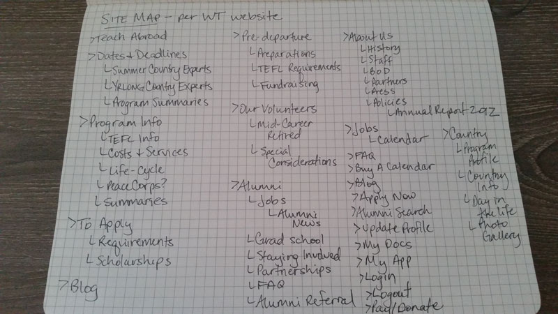
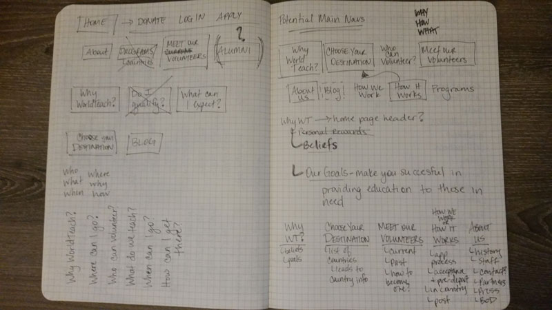

# Site Map

[Link to WorldTeach's current Site Map](http://www.worldteach.org/site/c.buLRIbNOIbJ2G/b.6150653/k.D65E/Site_Map/apps/sitemap/sitemap.asp)

## My Sketch of the Site Map 

## My Outline of WorldTeach's Version of the Site Map

## Content & Organizational Observations

From an analysis of WorldTeach's content, here are key conclusions:

* A LOT of content
* A LOT of links to get to different areas of the site
* The actual site mapping done by WorldTeach on their website isn't consistent with everything displayed on their website
* I didn't even notice there was a subnavigation to the main nav on the pages where this exists until I was working through their site map and wondering where do you get to all of these pages on the site
* There is repetitive information throughout the site
* Segmentation of content is not intuitive through navigation and subnavigation menus

## Brainstorming Sketches of New Site Map & Content Structure

