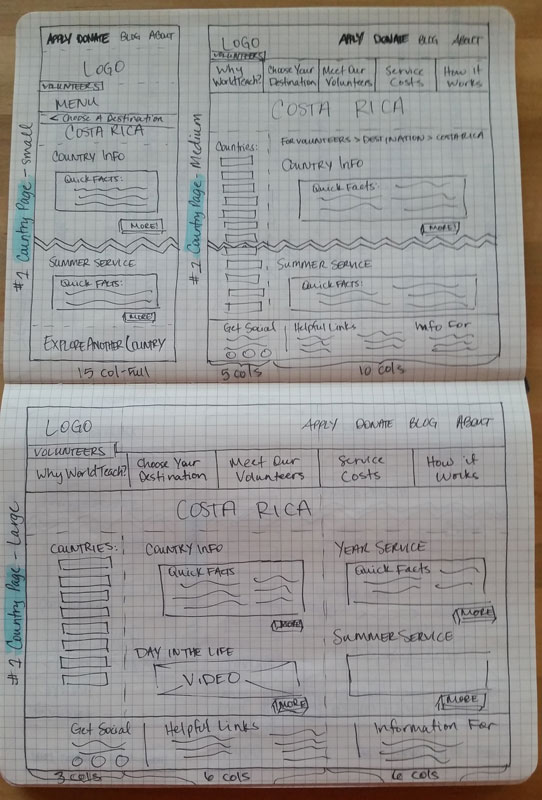
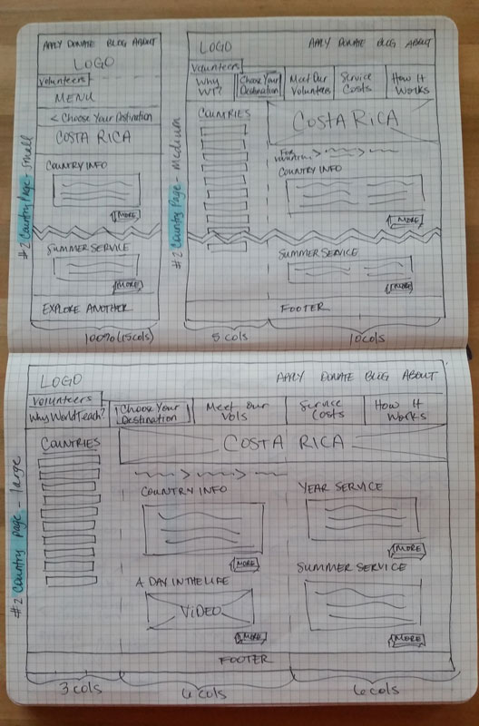
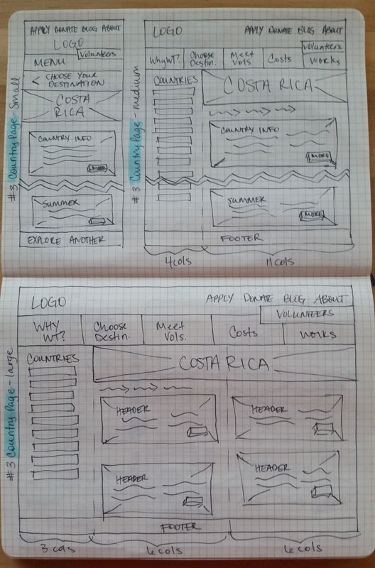
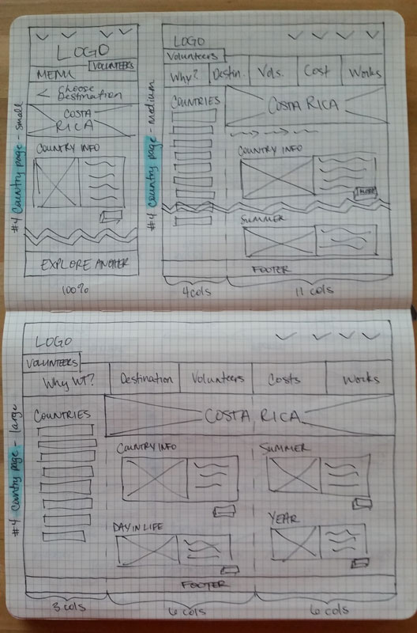
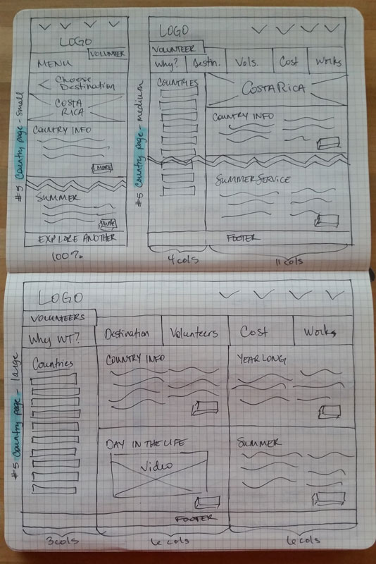
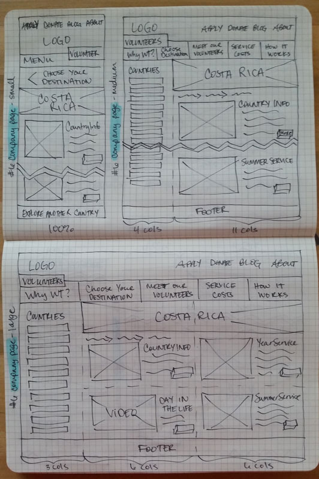
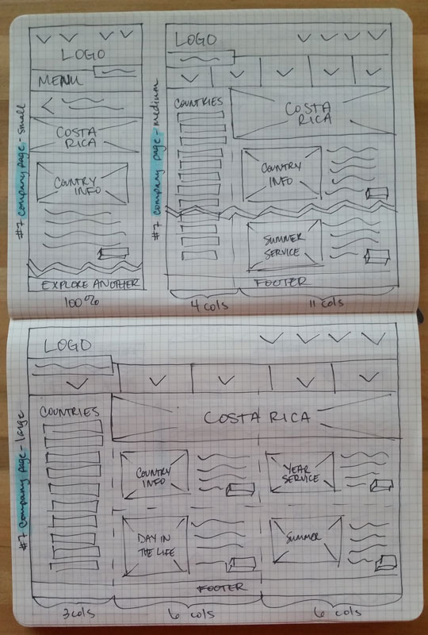
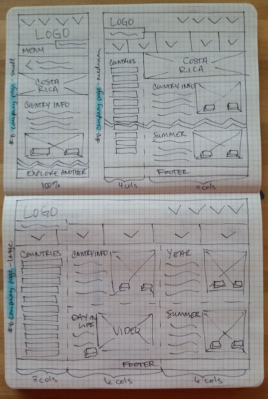
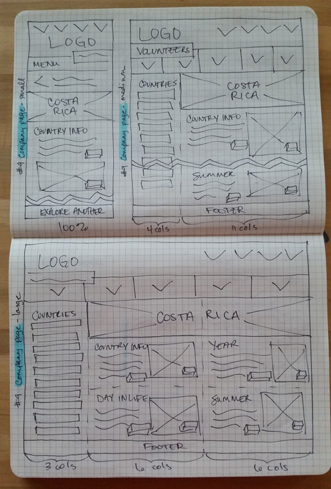
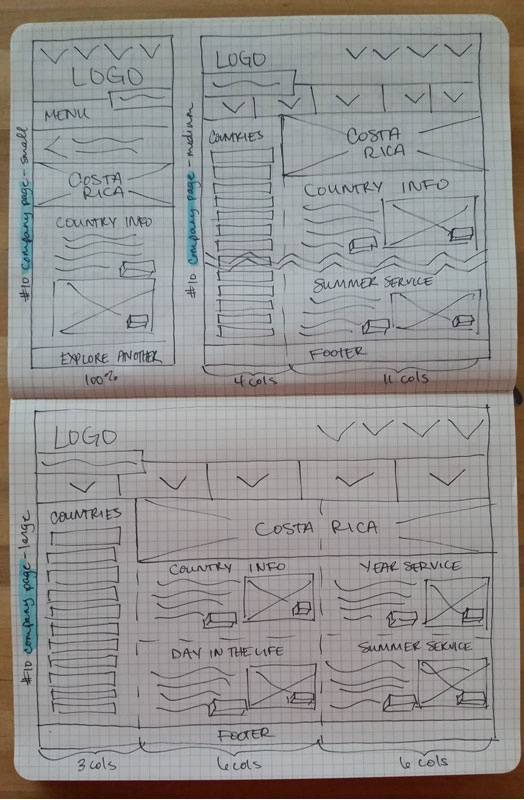

# Sketches

For my 10 sketch iterations, I sketched differen versions of the Country Page. I chose this page again because of the large content to ensure I could make my grid and layout work with the most content. 

I use a 15 column grid throughout the sketches. I chose the 15 column grid in order to allow enough space on the left hand side of the medium and large sizes for a sub-navigation column, while also providing the largest section with the actual content to expand across the remaining space. 

## Country Page - Costa Rica - #1

## Country Page - Costa Rica - #2

## Country Page - Costa Rica - #3

## Country Page - Costa Rica - #4

## Country Page - Costa Rica - #5

## Country Page - Costa Rica - #6

## Country Page - Costa Rica - #7

## Country Page - Costa Rica - #8

## Country Page - Costa Rica - #9

## Country Page - Costa Rica - #10

